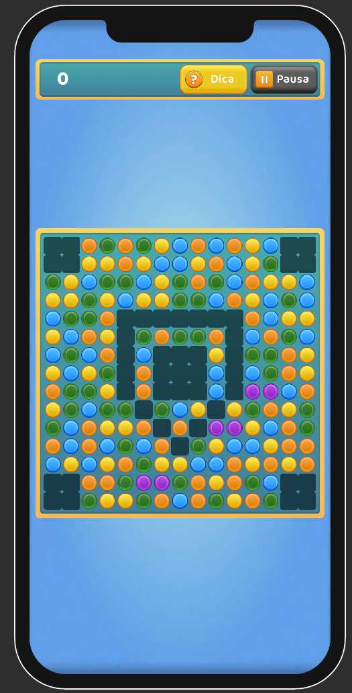

# Desafio Match-3 — Kaio Oura

## Introdução

O projeto original já tinha o fluxo básico de um Match-3 funcionando: trocar peças, encontrar combinações, derrubar as peças e preencher o tabuleiro novamente.

Antes de começar a implementar as novas mecânicas, passei um tempo entendendo como o código estava estruturado. A maior parte da lógica estava concentrada em poucos métodos. O `SwapTile`, por exemplo, tinha cerca de 100 linhas e alguns loops aninhados. A verificação de três peças iguais também aparecia implementada de formas diferentes em mais de um lugar.

Outro detalhe que dificultava a leitura era a diferença entre as camadas. O board utilizava `[y][x]`, enquanto a view trabalhava com `(x, y)`. Isso fazia com que fosse necessário ficar convertendo mentalmente os eixos durante a leitura do código.

Como as mecânicas de 4 e 5 peças dependiam bastante dessa parte, preferi reorganizar essa base antes de começar a implementar os requisitos.

## Como rodar

Abrir o projeto na Unity, carregar:

`Assets/Project/Scenes/Boot.unity`

e pressionar **Play**.

O fluxo principal é:

`Boot → Menu → Seleção de fases → Gameplay`

Também é possível abrir a cena `Gameplay` diretamente. Nesse caso, ela utiliza uma fase de fallback configurada pelo Inspector.

## O que foi implementado

### Requisitos obrigatórios

* Sistema de pontuação.
* Popup de pontuação por cascata.
* Animação do placar.
* Combinações acima de 3 peças.
* Limpeza de linha.
* Explosão em área.
* Limpeza de peças da mesma cor.

### Extras

Também implementei algumas funcionalidades além dos requisitos:

* Object Pooling.
* Adaptação para diferentes resoluções.
* Safe Area.
* Áreas bloqueadas no tabuleiro.
* Editor para criação das áreas bloqueadas.
* Seletor de fases.
* Menu.
* Pausa.
* Loading entre cenas.
* Dica de jogada.
* Detecção de fim de partida quando não existem mais movimentos.
* Partículas.
* SFX.
* Reskin utilizando o Hyper Casual UI Pack.

---

## Refatoração da base

### Board

O projeto original utilizava `List<List<Tile>>`. Troquei por uma classe `Board` utilizando `Tile[,]` e padronizei o acesso como `[x, y]` desde a lógica até a view.

Além de deixar o acesso mais direto, isso também ajudou a evitar alguns problemas com largura e altura do tabuleiro.

Durante essa alteração encontrei um bug na construção da máscara de matches. Um dos loops utilizava a altura onde deveria utilizar a largura. Em um tabuleiro mais largo que alto, isso acabava causando um acesso inválido.

Com `Width` e `Height` centralizados no `Board`, esse tipo de erro fica mais difícil de acontecer.

### Match detection

A lógica de encontrar três peças iguais estava duplicada em alguns pontos do projeto. Centralizei essa parte em uma única rotina de varredura.

Ela recebe uma direção:

* `(1, 0)` para verificar linhas.
* `(0, 1)` para verificar colunas.

Assim, a mesma lógica é utilizada nos dois casos em vez de manter duas implementações praticamente iguais.

### Validação de movimentos

O `IsValidMovement` original copiava o tabuleiro para verificar se uma troca resultaria em um match.

Isso foi simplificado para:

1. Fazer o `Swap`.
2. Verificar se existe match.
3. Fazer o `Swap` novamente.

Como o `Swap` é seu próprio inverso, não é necessário criar uma cópia inteira do board só para essa verificação.

---

## Mecânicas de Match

Essa foi uma das partes que mais mudou.

A primeira solução que implementei utilizava `enum` + `switch`. Funcionava, mas cada nova mecânica acabava exigindo alterações em vários lugares.

Por exemplo, adicionar uma nova combinação significava adicionar um valor no enum, um novo `case` para detectar a combinação e outro para executar o efeito.

Acabei substituindo isso por dois contratos:

* `MatchDetector`
* `MatchEffect`

Ambos são `ScriptableObject`.

O `SpecialMatchConfig` possui uma lista ordenada de pares detector/efeito. Essa lista acaba funcionando como uma tabela de regras do jogo.

A vantagem dessa abordagem é que uma nova mecânica não precisa conhecer o `GameService`.

Para adicionar uma nova combinação, basta criar o detector, criar o efeito e adicionar o par na configuração.

Usei o quadrado 2×2 para testar justamente isso. Ele foi adicionado como um novo detector e um novo efeito, sem precisar alterar o `GameService` ou o `IsValidMovement`.

Também deixei um `Line4Detector` pronto na pasta para facilitar a configuração dessa variação.

### L, T e +

Para L, T e + a detecção é: procuro dois runs do mesmo tipo, um horizontal e outro vertical, que compartilham uma peça.

A posição dessa peça dentro dos dois runs permite diferenciar as formas.

Como o `Match` também possui informações como `Origin` e `Axis`, o efeito consegue saber qual linha ou coluna deve ser afetada.

A cross bomb segue a mesma ideia.

### Ordem dos detectores

A ordem da lista também tem uma função importante.

Quando duas regras encontram a mesma peça e `StackEffects` está desativado, a regra que aparece primeiro fica responsável pelo efeito. A regra seguinte ainda pode remover as peças do match, mas não substitui o efeito.

Se as combinações estiverem em partes diferentes do tabuleiro, as duas podem ser executadas.

A regra de três peças pode ficar no topo porque ela não possui efeito especial e, portanto, não disputa a criação de um efeito.

Isso também facilita alguns ajustes de balanceamento sem precisar alterar código.

---

## Pontuação

A pontuação foi separada em um `ScoreService`, em vez de ficar dentro do `GameService`.

Ela considera:

* Tipo das peças destruídas.
* Quantidade de peças extras na combinação.
* Cascata.

A fórmula utilizada é:

`pontos × (1 + extras × 0,5) × (1 + cascata)`

Os multiplicadores ficam no `ScoreConfig`.

Os tipos de peças também são `ScriptableObject` e possuem seus próprios pontos e pesos de sorteio.

Foram criados sete tipos e cinco estão sendo utilizados atualmente:

* Quatro tipos valem 10 pontos e possuem peso 1.
* A peça roxa vale 20 pontos e possui peso 0,2.

Assim, tanto a pontuação quanto a chance de aparecer uma peça rara podem ser alteradas pelo Inspector.

---

## Object Pooling

No projeto original, as peças eram criadas com `Instantiate` durante o refill e destruídas com `Destroy` quando faziam match.

Troquei isso por um `PrefabPool` baseado no `ObjectPool<T>` da Unity.

Os principais objetos reutilizados são:

* Tiles.
* Partículas.
* Popups de pontuação.

Além de evitar ficar criando e destruindo objetos durante as cascatas, isso também reduziu algumas alocações que aconteciam durante o gameplay.

### Um detalhe com DOTween

O pooling trouxe um problema que não existia quando os objetos eram destruídos.

Antes, o `Destroy` acabava eliminando também qualquer tween que estivesse rodando naquele objeto. Com pooling, o objeto volta para o pool e pode ser reutilizado.

Sem tratar isso, um tile poderia voltar para o tabuleiro ainda executando um `DOMove` iniciado na utilização anterior.

Por isso faço `DOKill` no momento em que o objeto é devolvido ao pool.

---

## Busca de matches

Os detectores compartilham um `BoardScan` que é calculado durante a resolução do match.

A ideia é evitar que cada detector precise fazer uma nova varredura completa do tabuleiro.

Um ponto que eu deixaria para uma próxima otimização é o `HasAnyMatch`.

Ele responde se existe alguma combinação no tabuleiro, e para isso monta a varredura inteira. A implementação original conseguia parar assim que encontrava a primeira.

Onde isso mais aparece é na busca por jogadas. O `MoveFinder` testa as trocas possíveis uma a uma e chama o `HasAnyMatch` a cada tentativa, então cada troca testada custa uma varredura do tabuleiro inteiro. E ele roda toda vez que o tabuleiro se estabiliza, porque é o que alimenta a dica e a checagem de fim de partida. O pior caso é justamente o tabuleiro sem jogada disponível, quando nenhuma tentativa retorna cedo.

Para os tamanhos utilizados no teste, inclusive 10×10, a diferença é muito pequena. Mas se o tamanho do tabuleiro aumentasse bastante, esse seria um dos primeiros pontos que eu revisaria.

O `MatchResolver` já reaproveita a lista de matches entre chamadas, então seria possível aplicar a mesma ideia aos outros buffers que ele aloca a cada varredura.

---

## Fases

As fases foram separadas do código através de `LevelConfig`.

Cada fase possui:

* Largura.
* Altura.
* Máscara de células bloqueadas.

As quatro fases utilizadas são assets, e a fase selecionada é mantida pelo `LevelSession` até a cena de Gameplay.

Também criei um editor próprio em:

`Gazeus/Level Editor`

Nele é possível clicar nas células do grid para definir as áreas bloqueadas.

Com isso, uma nova fase pode ser criada sem alterar código. Basta criar um novo `LevelConfig`.

---

## Responsividade

A interface utiliza `Canvas Scaler`, anchors e Safe Area para lidar com diferentes tamanhos e proporções de tela.

O tabuleiro também adapta sua escala de acordo com o espaço disponível.

A ideia foi evitar que a implementação dependesse de uma resolução específica e permitir que o mesmo conteúdo funcione em diferentes dispositivos.

---

## Composição da cena

O `GameplayInstaller` funciona como ponto de composição da cena.

Ele cria os principais serviços, como:

* `GameService`
* `ScoreService`

e conecta os controllers às views e configurações necessárias.

Preferi manter essa composição em um único lugar para facilitar a leitura de como a cena está montada.

Também deixei a ordem de inicialização explícita no `Awake`, em vez de depender de atributos de execução espalhados pelos controllers.

Os sistemas que precisam sobreviver à troca de cena, como `ScreenManager` e `SceneLoader`, continuam utilizando uma instância persistente.

---

## O que ficou de fora

A principal funcionalidade que não entrou foi a peça-poder persistente, no estilo Candy Crush.

Nesse modelo, um match de 4 ou 5 peças cria uma peça especial que permanece no tabuleiro e pode ser utilizada pelo jogador em outro momento.

Na implementação atual, o efeito acontece imediatamente após o match.

Escolhi manter dessa forma porque se encaixava melhor no pipeline que já existia. Implementar a peça persistente exigiria adicionar estado ao `Tile` e também uma regra para ativar esse poder em um movimento futuro.

A desvantagem é que o jogador perde a possibilidade de guardar uma peça especial para usar em um momento melhor.

Caso essa mecânica fosse adicionada posteriormente, a estrutura atual permite implementá-la como novos `MatchDetector` e `MatchEffect`, seguindo o mesmo padrão das outras mecânicas.

---

## Organização do desenvolvimento

As alterações foram separadas em branches por assunto, partindo de `develop`.

Isso facilitou manter as funcionalidades isoladas e tornou os merges mais seguros durante o desenvolvimento.

---

## Considerações finais

A principal preocupação durante a implementação foi evitar que as novas mecânicas aumentassem a complexidade do `GameService`.

Por isso, a maior parte das regras específicas ficou separada em `MatchDetector`, `MatchEffect` e `ScriptableObject`, enquanto o `GameService` permanece responsável pelo fluxo geral do gameplay.

Isso também deixa o projeto preparado para receber novas combinações, efeitos, tipos de peças e fases com alterações principalmente em configurações e novas implementações isoladas, em vez de concentrar todas as regras em um único sistema.

Considero essa separação importante não apenas pela funcionalidade entregue, mas principalmente pela facilidade de manutenção e extensão do projeto.
